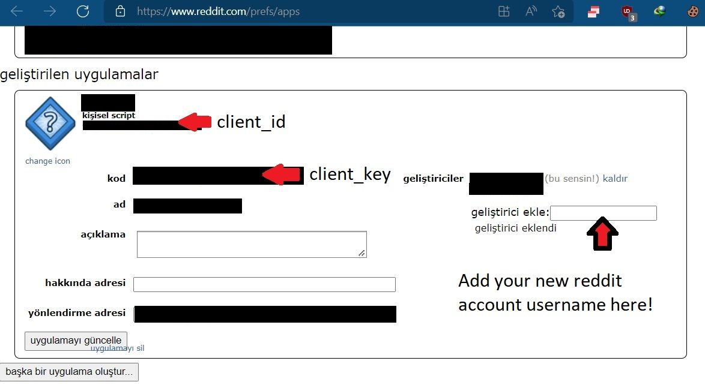

# reddit-jpg-downloader
 Downloads jpg's from selected reddit community. Delete the broken ones.
 Create spare reddit account.(Bot Account)
 Login your main reddit acc.
 Goto https://www.reddit.com/prefs/apps
 Create a new app.
 Select script.
 Insert a name.
 Get the required info from there.
 Add bot account username as developer to main reddit account.
 Use bot accounts username password in python file.
 There is a reason for time.sleep() So if you don't understand what it does. Just leave it there. (It's about Reddit Api Limits.)
# Update
 Now it detects broken img and deletes them. Also converts png to jpg.
 Removes all special characters from filenames. Just names them like 0.jpg,1.jpg... etc.
# Screenshot:

  
